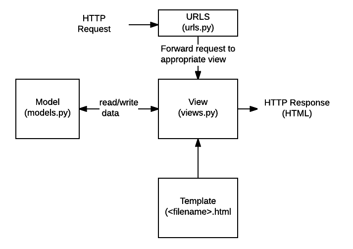

# Django

## MODEL-DB

"""  
django-admin startproject MODEL  
python manage.py startapp students  
실행 후  
settings.py 에 출생신고
"""

### 1. MODEL/students/model.py

```python
from django.db import models

# Create your models here.
# 테이블 명
# 컬럼 명 = 데이터 타입

class Student(models.Model):
    name = models.CharField(max_length=10)
    address = models.TextField()
    major = models.CharField(max_length=100)
    age = models.IntegerField()
    cgpa = models.FloatField()

class Professor(models.Model):
    name = models.CharField(max_length=10)
    major = models.CharField(max_length=100)
    room = models.TextField()
    year = models.IntegerField()
```

### 2. CRUD

- from students.models import Student 실행
- professor) from students.models import Professor

#### `생성Create `

s = Student()  
s.name = '김학생'  
 s.address = '서울'  
 s.major = '컴공'  
 s.age = 25  
 s.cgpa = 3.7  
 s.save()

Student.objects.create(  
name = '박학생',  
major='경영',  
age = 27,  
address='부산',  
cgpa=3.3  
)# 얘는 따로 save 필요없음 알아서 save 되는거임

#### `조회 Read(Retrieve)`

1. 전체 조회

students = Student.objects.all()
for student in students:
print(student.pk, student.name, student.major)

2. 단일 조회

Student.objects.get(id=1) # 컬럼명
s1 = Student.objects.get(pk=1) # primary key
print(s1.name, s1.address)

#### `수정 Update`

s1 = Student.objects.get(pk=1)
s1.cgpa = 4.0
s1.save()

#### `삭제 Delete(Destroy)`

s1 = Student.objects.get(pk=1)
s1.delete()

===

#id 한 번 할당되면 끝임
#ex. 1, 2,3 있는데 3 지우고 새로운 컬럼 추가하면 개는 id가 3이 아니라 4임.

### 3. python manage.py shell vs ipython

1. $ python manage.py shell => Django 내부 코드와 연동
2. ipython => 그냥 python

### 4. if **name** == '**main**' //내용보충필요

```python
#a.py

def a():
    print('a')
print('b')

#module_a.py
import a
print('c')

# => b a c 출력됨
```

### 5. ORM

Object Relational Mapping(객체-관계-매핑)  
객체와 데이터베이스의 관계를 매핑해주는 도구


### 6. `python managelpy makemigrations <app_name>`

project_name = BOARD3  
app_name = board

=>

- board/urls.py, board/views.py
- board3/urls.py
- 등이 기본적인 코드를 어느정도 적어야 명령어가 작동한다.
